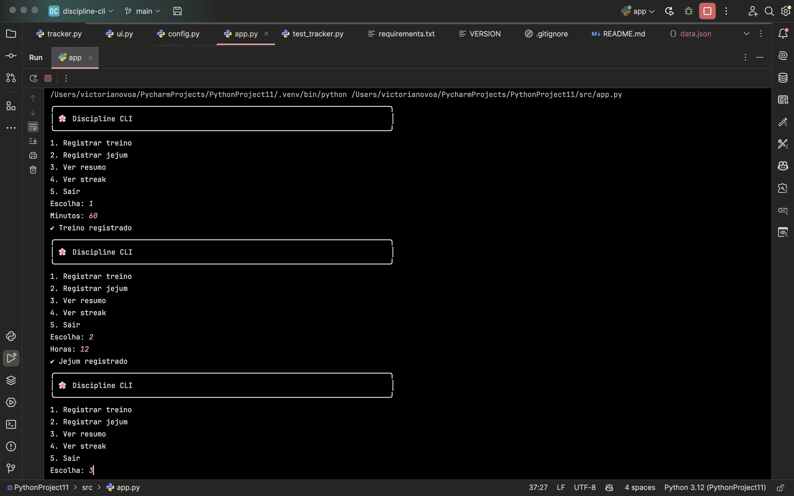
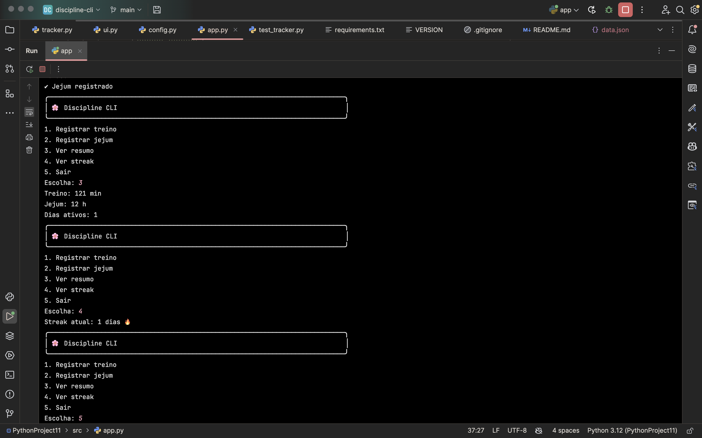
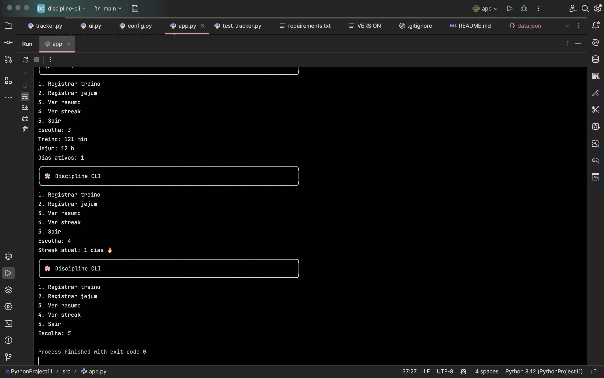

# Discipline CLI 🏋🏻‍💪🏻💅🏻

Aplicação CLI para monitoramento de hábitos de wellness como treinos diversos e jejum intermitente.


## Funcionalidades
- Registro de treino
- Registro de jejum
- Cálculo de total de horas registradas
- Streak de consistência
- Meta semanal

## 🌍 Impacto Social

Este projeto busca auxiliar pessoas que enfrentam dificuldades em manter disciplina em hábitos saudáveis, como prática de exercícios e controle alimentar.

A aplicação oferece uma forma simples e acessível de monitoramento, contribuindo para autonomia, saúde e bem-estar.

## Execução
python src/app.py

## ▶️ Como executar

```bash
pip install -r requirements.txt
python src/app.py

## Testes
pytest

## Versão
1.0.0

## Autora
Victória Nóvoa 

## 📸 Exemplo de uso






## 🚀 Futuro

Projeto de software apresentado como critério avaliativo parcial para a disciplina de Bootcamp II, ministrada pelo Prof. Romes Heriberto, no CEUB, para o curso de bacharelado em Engenharia de Software, na cidade de Brasília, DF, em abril de 2026. Já é um projeto pensado para evolução futura em aplicações web, podendo ser integrado a plataformas de personal trainers, dashboards de performance e sistemas de acompanhamento em tempo real.
